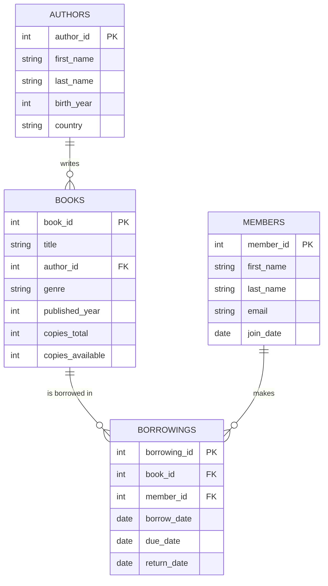

# 📚 Library Management System — SQL Project

A beginner-friendly SQL project that models a small library: books, authors,
members, and borrowing records. Built to practice schema design, foreign
keys, and real-world query patterns (joins, aggregates, subqueries).

## Entity-Relationship Diagram



## Project Structure

```
library-management-sql/
├── schema.sql       # CREATE TABLE statements, keys, indexes
├── seed_data.sql    # Sample data (5 authors, 8 books, 5 members, 10 borrowings)
├── queries.sql       # 10 practice queries (joins, aggregates, subqueries)
├── README.md
└── .gitignore
```

## Tech Stack

- **SQLite** — zero-setup, single-file database, perfect for learning
  (the SQL is standard enough to adapt to MySQL/PostgreSQL with minor tweaks)

## How to Run

1. Install SQLite (if you don't have it already):
   ```bash
   # macOS
   brew install sqlite3
   # Ubuntu/Debian
   sudo apt install sqlite3
   ```
2. Build the database:
   ```bash
   sqlite3 library.db < schema.sql
   sqlite3 library.db < seed_data.sql
   ```
3. Run the practice queries:
   ```bash
   sqlite3 library.db < queries.sql
   ```
   Or open an interactive session and explore:
   ```bash
   sqlite3 library.db
   sqlite> .tables
   sqlite> SELECT * FROM books;
   ```

> No SQLite installed? You can also paste `schema.sql` and `seed_data.sql`
> into an online SQL sandbox like [SQLite Online](https://sqliteonline.com/).

## What This Project Demonstrates

- **Schema design** — primary keys, foreign keys, `ON DELETE CASCADE`,
  sensible data types and constraints
- **Normalization** — a junction table (`borrowings`) to model the
  many-to-many relationship between books and members
- **Indexing** — indexes on foreign key columns for faster joins
- **Querying** — `INNER JOIN` / `LEFT JOIN`, `GROUP BY` with aggregates,
  subqueries (`NOT IN`), date arithmetic, and `HAVING`

See [`queries.sql`](./queries.sql) for the full list, including:
- Currently borrowed & overdue books
- Most active members
- Most popular genres
- Books that have never been borrowed
- Average borrowing duration

## Possible Extensions

- Add a `fines` table for overdue penalties
- Add a `reservations` table for books that are on hold
- Build a small front-end (Python/Flask or a notebook) on top of this database
- Port the schema to PostgreSQL and deploy on Supabase/Railway

## License

This project is open source under the [MIT License](LICENSE).
